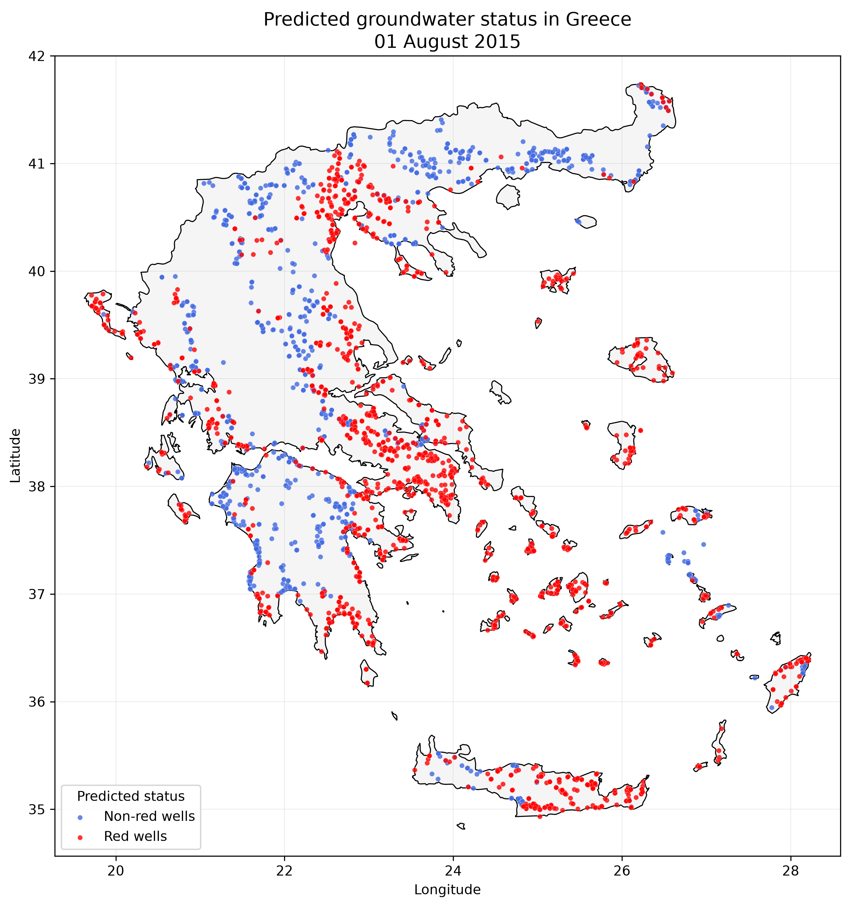
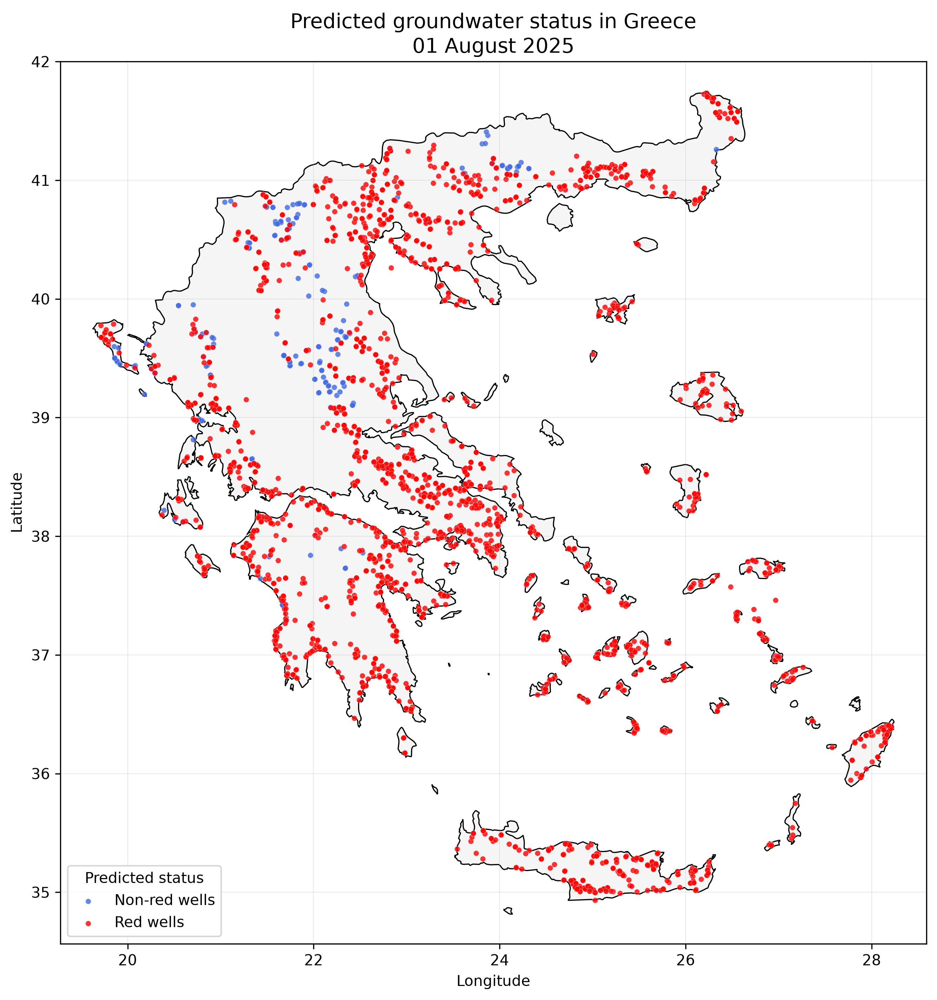
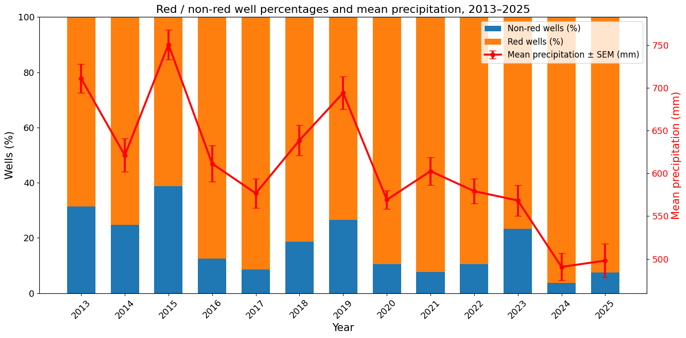

# WellsWatch

[](https://www.python.org/)
[](LICENSE)
[](https://doi.org/10.5281/zenodo.20427364)

**WellsWatch** is a lightweight Python library for retrieving published groundwater-status predictions from Zenodo and visualizing red and non-red monitoring wells across Greece.

It is designed for researchers, water-resource managers, hydrogeologists, and other users who need a simple and reproducible way to access and map the national groundwater prediction dataset.

> WellsWatch does **not** train a machine-learning model or generate new predictions. It retrieves and visualizes predictions that have already been published on Zenodo.

---

## Why WellsWatch?

Groundwater observations and model outputs are often distributed across multiple files and monitoring locations. WellsWatch provides a simple Python interface that:

- downloads the requested prediction file directly from Zenodo;
- validates the expected data structure;
- extracts the prediction date from the filename;
- distinguishes `red` and `non_red` monitoring wells;
- creates a national map of Greece;
- saves the generated map as a high-resolution image when requested.

The main workflow requires only two lines of Python:

```python
from wellswatch import show_map

show_map(2025)
```

---

## Example maps and hydroclimatic context

The two maps below illustrate groundwater-status predictions under contrasting hydroclimatic conditions.

### 1 August 2015 — wet year

The year 2015 was a comparatively wet year within the 2013–2025 series. The map shows a larger proportion of non-red wells than in the recent dry years, although red-state conditions were still predicted at many monitoring stations.

```python
from wellswatch import show_map

show_map(2015)
```



### 1 August 2025 — dry year

The year 2025 was a comparatively dry year, following the very dry conditions observed in 2024. The map is dominated by red wells, indicating widespread deeper-than-normal groundwater conditions relative to the historical reference used by the classifier.

```python
from wellswatch import show_map

show_map(2025)
```



In both maps:

- **Red wells** represent monitoring stations classified as being in a red groundwater state.
- **Non-red wells** represent monitoring stations not classified as red.
- WellsWatch uses the published class label directly and does not recalculate the classification from the probability column.

### Predictions from 2013 onward and annual precipitation

The figure below summarizes the annual percentages of wells predicted as red and non-red from 2013 onward, together with mean annual precipitation and its standard error of the mean (SEM).



Across the series, wetter years generally show a larger percentage of non-red wells, whereas drier years tend to show a larger percentage of red wells. The contrast is particularly clear between wet 2015 and dry 2025. This figure provides a descriptive comparison of groundwater-status predictions and precipitation; it should not, by itself, be interpreted as evidence of a causal relationship.

---

## Installation

After publication on PyPI:

```bash
pip install wellswatch
```

For local development from the GitHub repository:

```bash
git clone https://github.com/Mil-afk/wellswatch.git
cd wellswatch
python -m venv .venv
```

Activate the virtual environment on Windows:

```powershell
.\.venv\Scripts\Activate.ps1
```

Install the package in editable mode:

```bash
python -m pip install -e ".[dev]"
```

---

## Quick start

### Display a map

```python
from wellswatch import show_map

show_map(2025)
```

The current Zenodo record contains prediction files for 1 August of each year from 2013 to 2025. WellsWatch 
is designed to provide maps for all available years from 2013 onward, as new annual prediction files are 
added to the Zenodo record. Therefore:

```python
show_map(2025)
```

is equivalent to:

```python
show_map(2025, month=8, day=1)
```

### Save a map

```python
from wellswatch import show_map

show_map(
    2025,
    save_path="wellswatch_2025.png",
)
```

### Change marker size

```python
from wellswatch import show_map

show_map(
    2025,
    marker_size=20,
)
```

### Load prediction data without plotting

```python
from wellswatch import load_prediction_from_zenodo

data = load_prediction_from_zenodo(2025)

print(data.head())
print(data["realtime_pred_class_name"].value_counts())
```

### Inspect the available Zenodo files

```python
from wellswatch import list_zenodo_files

for filename in list_zenodo_files():
    print(filename)
```

### Read a local prediction file

```python
from wellswatch import load_prediction_file

data = load_prediction_file(
    "13_pred_2025_08_01_with_predictions_01.xlsx"
)
```

---

## Returned data

`load_prediction_from_zenodo()` and `load_prediction_file()` return a pandas `DataFrame`.

The prediction files contain the following columns:

| Column | Description |
|---|---|
| `row_id` | Row identifier |
| `station_code` | Groundwater monitoring-station code |
| `lon` | Longitude in decimal degrees |
| `lat` | Latitude in decimal degrees |
| `realtime_pred_class_name` | Published class label: `red` or `non_red` |
| `realtime_pred_red_probability` | Predicted probability of red-state classification |

WellsWatch adds:

| Column | Description |
|---|---|
| `prediction_date` | Date extracted automatically from the filename |

The returned `DataFrame` also includes source metadata in `data.attrs`:

```python
print(data.attrs)
```

Example:

```text
{
    "source": "Zenodo",
    "zenodo_record_id": "20427364",
    "source_filename": "13_pred_2025_08_01_with_predictions_01.xlsx"
}
```

---

## Main API

| Function | Purpose |
|---|---|
| `show_map()` | Download predictions from Zenodo and display or save the map |
| `load_prediction_from_zenodo()` | Retrieve a prediction file directly from Zenodo |
| `load_prediction_file()` | Read a local Excel or CSV prediction file |
| `list_zenodo_files()` | List files available in the Zenodo record |
| `plot_wells()` | Plot an existing prediction `DataFrame` |
| `predictions_to_geodataframe()` | Convert prediction data to a GeoDataFrame |
| `extract_prediction_date()` | Extract the prediction date from a filename |
| `validate_predictions()` | Validate required columns and values |

---

## Data source

The groundwater-status predictions are distributed through the following open Zenodo dataset:

**Tziritis, E., Iatrou, M., Drougas, C., Tasoglou, S., & Arampatzis, G. (2026). _Hydrogeological controls on seasonal groundwater level dynamics across Greece: a national-scale assessment integrating monitoring data, earth observation, and machine learning (2013–2022)_ [Data set]. Zenodo.**

DOI: [10.5281/zenodo.20427364](https://doi.org/10.5281/zenodo.20427364)

The dataset is licensed under the **Creative Commons Attribution 4.0 International License (CC BY 4.0)**.

---

## Project structure

```text
wellswatch/
├── docs/
│   ├── red_nonred_precipitation_2013_2025.png
│   ├── wellswatch_2015.png
│   └── wellswatch_2025.png
├── src/
│   └── wellswatch/
│       ├── __init__.py
│       ├── mapping.py
│       └── zenodo.py
├── tests/
├── LICENSE
├── README.md
└── pyproject.toml
```

---

## Authors

- Evangelos Tziritis
- Miltiadis Iatrou
- Christos Drougas
- Spyridon Tasoglou
- George Arampatzis

Maintainer: **Miltiadis Iatrou**

---

## Citation

When using the groundwater prediction data, cite the Zenodo dataset:

```text
Tziritis, E., Iatrou, M., Drougas, C., Tasoglou, S., & Arampatzis, G.
(2026). Hydrogeological controls on seasonal groundwater level dynamics
across Greece: a national-scale assessment integrating monitoring data,
earth observation, and machine learning (2013–2022) [Data set]. Zenodo.
https://doi.org/10.5281/zenodo.20427364
```

When referring specifically to the software, also cite the WellsWatch GitHub repository:

```text
WellsWatch, version 0.1.0.
https://github.com/Mil-afk/wellswatch
```

---

## Licenses

- The **WellsWatch source code** is distributed under the [MIT License](LICENSE).
- The **Zenodo prediction dataset** is distributed under the CC BY 4.0 License.

---

## Acknowledgement

WellsWatch uses publicly archived prediction files from Zenodo and country-boundary data from Natural Earth for map visualization.
